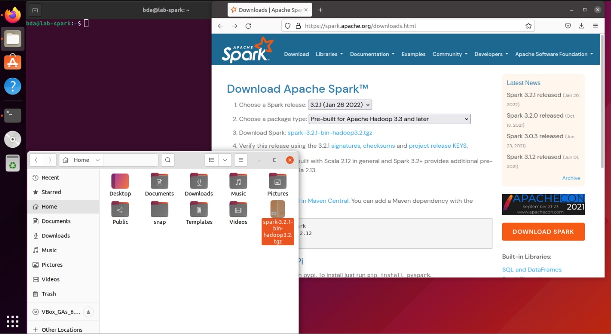

# Linux

## Package Manager

`Linux` users should be able to use their package manager to install all of the software from this
page.

However note that if you are running an older `Linux` distribution you may get older versions with
different look and features. We target [Ubuntu 21.10][ubuntu-21.10] for the sake of homogeneity.

```{tip}

We recommend to upgrade the system and get the latest security packages: `sudo apt-get upgrade`

Please do not forget to restart after the upgrade finishes.
```

You can test the `Python` version by issuing:

```shell
python3 --version
```

You should get an output similar to the following:

```text
Python 3.9.7
```

## Python via package manager

Recents versions of `Ubuntu` come with mostly up to date versions of all needed packages.

The version of `IPython` might be slightly out of date. Thus, you may wish to upgrade this using
`pip`.

You should ensure that the following packages are installed using `apt-get`:

- `python3-pip`
- `jupyter`
- `ipython3`


```shell
sudo apt-update
sudo apt-get install -y gcc make perl python3-pip jupyter ipython3
```

You can test the installation by issuing:

```shell
pip --version
```

You should get an output similar to the following:

```text
pip 20.3.4 from /usr/lib/python3/dist-packages/pip (python 3.9)
```

## Editor

You have many different text editors suitable for programming at your fingertips. Here is an
opinionated list of editors in case you do not already have a favourite:

- [Visual Studio Code](https://code.visualstudio.com/)
- [Atom](https://atom.io)
- [Neovim](https://neovim.io)
- [Vim](https://www.vim.org)

## Apache Spark

```{admonition} TL;DR
You can skip the whole [Step-by-step Setup section](#step-by-step-setup) by issuing the
following commands in a terminal.

```shell
cd ~
wget https://dlcdn.apache.org/spark/spark-3.2.1/spark-3.2.1-bin-hadoop3.2.tgz
sudo tar -xzvf spark-3.2.1-bin-hadoop3.2.tgz
sudo apt-get install openjdk-8-jre -y
echo 'SPARK_HOME=~/spark-3.2.1-bin-hadoop3.2' >> ~/.bashrc
echo 'PATH=$SPARK_HOME/bin:$PATH' >> ~/.bashrc
echo 'PYTHONPATH=$SPARK_HOME/python:$PYTHONPATH' >> ~/.bashrc
echo 'PYSPARK_DRIVER_PYTHON=jupyter' >> ~/.bashrc
echo 'PYSPARK_DRIVER_PYTHON_OPTS=notebook' >> ~/.bashrc
echo 'PYSPARK_PYTHON=python3.9' >> ~/.bashrc
echo 'export JAVA_HOME=/usr/lib/jvm/java-8-openjdk-amd64' >> ~/.bashrc
exec bash
jupyter notebook --generate-config
sed -i '/# c.NotebookApp.use_redirect_file/s/$*True/False/g' ~/.jupyter/jupyter_notebook_config.py
sed -i '/c.NotebookApp.use_redirect_file/s/^#*\s*//g' ~/.jupyter/jupyter_notebook_config.py
```

### Step-by-step Setup

We will setup [Apache Spark](https://spark.apache.org) now. You need to open the `downloads` page, and download a spark distribution.

#### Download Apache Spark

We suggest to choose the same options as on the screenshot below. If you see a newer version is
available, please feel free to choose it.


[Image Link](https://spark.apache.org/downloads.html)

```{tip}
We want the package in the right location, so open the file explorer and place it into your home
folder.


```

Then go to your command line and issue the following to unzip the downloaded file:

```shell
sudo tar -xzvf spark-3.2.1-bin-hadoop3.2.tgz
```

```{important} The above command assumes you downloaded version 3.2.1 with hadoop 3.2 binaries.
Please ammend it as needed.
```

#### Setup JRE

Next step is installing a JRE (Java Runtime Engine), so that we can use the PySpark shell (or submit
a job to a cluster):

```shell
sudo apt-get install openjdk-8-jre -y
export JAVA_HOME=/usr/lib/jvm/java-8-openjdk-amd64/jre/
```

#### Configure PySpark

We need to define several environment variables to let Spark find `Python` and use Jupyter notebooks when initiating the PySpark shell:

```shell
echo 'export SPARK_HOME=~/spark-3.2.1-bin-hadoop3.2' >> ~/.bashrc
echo 'export PATH=$SPARK_HOME/bin:$PATH' >> ~/.bashrc
echo 'export PYTHONPATH=$SPARK_HOME/python:$PYTHONPATH' >> ~/.bashrc
echo 'export PYSPARK_DRIVER_PYTHON=jupyter' >> ~/.bashrc
echo 'export PYSPARK_DRIVER_PYTHON_OPTS=notebook' >> ~/.bashrc
echo 'export PYSPARK_PYTHON=python3.9' >> ~/.bashrc
```

```{note}
PySpark requires the same minor version of Python in both driver and workers. This is why we specify what exact version to use
in the `PYSPARK_PYTHON` variable.
```

```{important} Please do not forget to reload your interactive shell session. [^footnote1]
```

#### Workaround for Jupyter Notebooks in Linux

If you start a PySpark shell (i.e., `pyspark`) and get a "Access to the file was denied after
starting...", then you could try the following workround. [^footnote2]

```shell
jupyter notebook --generate-config
sed -i '/# c.NotebookApp.use_redirect_file/s/$*True/False/g' ~/.jupyter/jupyter_notebook_config.py
sed -i '/c.NotebookApp.use_redirect_file/s/^#*\s*//g' ~/.jupyter/jupyter_notebook_config.py
```

[ubuntu-21.10]: https://releases.ubuntu.com/21.10/
[^footnote1]: https://www.delftstack.com/howto/linux/reload-bashrc/
[^footnote2]: https://github.com/jupyter/notebook/issues/4353#issuecomment-570564277

